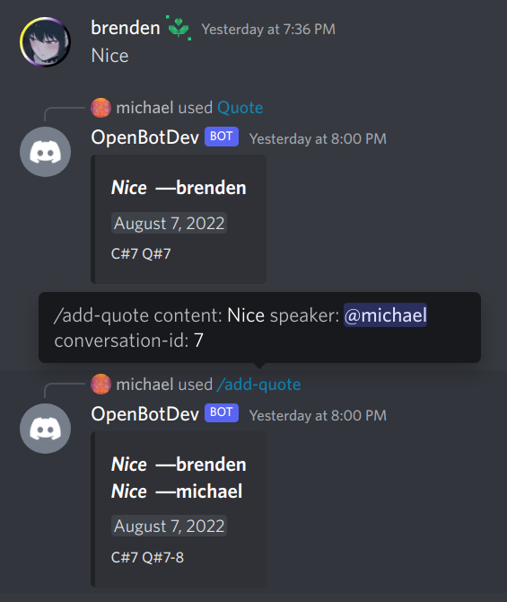

# OpenBot Docs

## Modules

### MessageStats

Basic collection of messaging statistics across all channels (that OpenBot can access).
For each message observed, this module records its ID, author ID, length, and time of receipt.

#### Commands

* `/mymessagestats` shows you the number of messages you have sent in bot-observable channels.

### Quotes

A record of interesting quotes, whether spoken in person or written on Discord.
The record consists of several **conversations**.
Each conversation is a sequence of **quotes**, possibly spoken or written by different people.
Each conversation has its own C#ID (example: `C#20`), and each statement has its own Q#ID (example: `Q#8`).

#### Commands

* The "Quote" context menu item adds the target message to the record as a conversation with a single quote.
  * You can access this command by right clicking on any message and then hovering over the menu item "Apps".
  * _Note: You currently cannot use this command to add a target message to an existing conversation.
     However, you can use the following command, `/add-quote`, to append more quotes to conversations
     created by the "Quote" context menu item._
* `/add-quote <content> <speaker> [conversation]` adds a quote to the record.
  * `content`: **Required** text spoken or written by the author.
  * `speaker`: **Required** Discord user of the author.
  * `conversation`: **Optional** conversation ID as an integer.
    To add this quote to a new conversation, leave this blank.
    To add this quote to an existing conversation, provide that conversation's ID (the number after "C#").

* `/random-quote` shows a random conversation from the record.
* `/read-conversation <id>` shows the conversation with the given C#ID.
  * `id`: **Required** conversation ID as an integer (the number after "C#").
