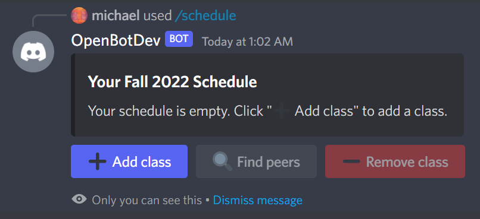
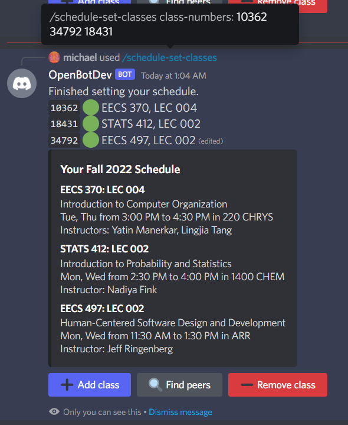

# Schedule Record

For the past two years, Living ArtsEngine has used a colorful spreadsheet to share schedules and find academic peers.
This module aims to replace that spreadsheet's functionality.
As a user, you can **edit your schedule** for any academic term and **find peers in your courses**.
You can also **discover alumni peers** who have already taken the courses you're taking.

## Quick Start

- **Interactively**: Run `/schedule`, and click "➕ Add class" to add each class in your schedule.

  

- **One command**: Go to [Wolverine Access](https://wolverineaccess.umich.edu/launch-task/all/backpacking) and pick your desired term. The class numbers of all the classes in your schedule are listed. Use the command `/schedule-set-classes`, and input all these class numbers separated by spaces.

  

Once you're done with setting your schedule, click "🔍 Find peers" or run `/schedule-peers` to see everyone who is taking or has taken the courses in your schedule.

If you're one of the earlier people to put in your schedule, you might not discover many peers right away. However, OpenBot will notify you via direct message when you have a new academic peer. To turn this off, run `/schedule-notify False`.

Please direct any issues and suggestions to `#open-bot-users`. Thanks!

## Other Commands

You can use the "➖ Remove class" button to remove any class from your schedule. To clear your schedule and start over, use `/schedule-clear`.

All commands except `/schedule-notify` have an optional parameter for the academic term. You may need to use it temporarily for Winter 2023, and peer mentors would use it to declare their past schedules to avail themselves as alumni peers.
